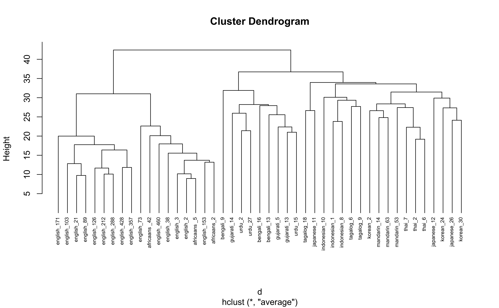
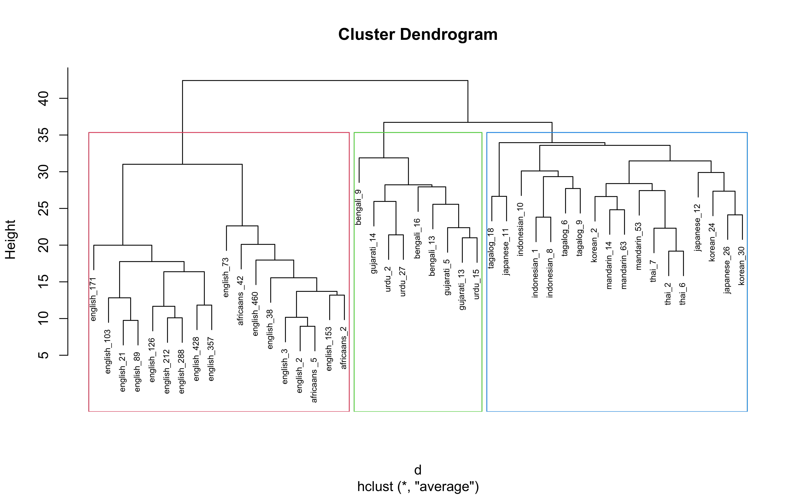
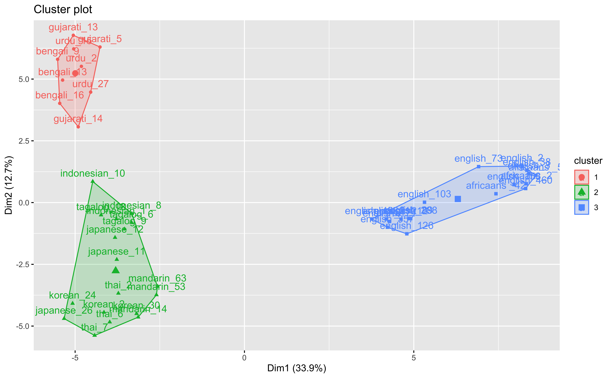

<!-- 
!!!! IMPORTANT: run `source("utils/render.R")` to publish instead of clicking on 'Knit'
-->

Introduction
============

``` r
library(easystats)

summary(report::report(sessionInfo()))
```

The analysis was done using the R Statistical language (v4.0.2; R Core
Team, 2020) on macOS Catalina 10.15.6, using the packages factoextra
(v1.0.7), effectsize (v0.4.1), ggplot2 (v3.3.2), stringr (v1.4.0),
forcats (v0.5.0), tidyr (v1.1.2), readr (v1.3.1), dplyr (v1.0.3),
rmarkdown (v2.6.6), here (v0.1), tibble (v3.0.6), purrr (v0.3.4),
parameters (v0.10.1.1), insight (v0.11.1.1), see (v0.6.1.1), performance
(v0.6.1.1), cluster (v2.1.1), modelbased (v0.4.0), easystats (v0.2.0),
correlation (v0.5.0), bayestestR (v0.8.0.1), report (v0.2.0), dendextend
(v1.14.0) and tidyverse (v1.3.0).

Data
----

``` r
df <- read_csv("data/class_wide_1.csv")
```

    > Parsed with column specification:
    > cols(
    >   .default = col_double(),
    >   speaker = col_character(),
    >   `54` = col_character()
    > )

    > See spec(...) for full column specifications.

Clustering
==========

Introduction
------------

In this task, individuals heard spoken speech tokens and freely
classified them into groups. Using hierarchical clustering we aim to see
what clusters or groups appear as a result of the free classification
task.

``` r
library(here)
library(tidyverse)  # data manipulation
library(cluster)    # clustering algorithms
library(factoextra) # clustering visualization
library(dendextend) # for comparing two dendrograms
```

### Data Preparation

1.  Rows are observations (individuals) and columns are variables
2.  Any missing value in the data must be removed or estimated.
3.  The data must be standardized (i.e., scaled) to make variables
    comparable (I am not doing this here)

### Read in the data

``` r
clust_data <- read_csv(here("data", "class_wide_1.csv")) # read in data
```

    > Warning: Missing column names filled in: 'X1' [1]

    > Parsed with column specification:
    > cols(
    >   .default = col_double(),
    >   speaker = col_character(),
    >   `54` = col_character()
    > )

    > See spec(...) for full column specifications.

``` r
clust_data <- select(clust_data, -X1, -`54`) # remove extra col sub 54 has weird formatting

clust_data <- as.data.frame(clust_data) # turn into df 

rownames(clust_data) <- clust_data$speaker # make row names speaker

clust_data <- select(clust_data,-speaker) # remove extra col sub 54 has weird formatting

head(clust_data)# show first couple rows
```

    >             8 7 1 10 11 12 14 15 16 17 18 19 2 20 23 25 26 27 28 29  3 30 31 32 33
    > bengali_9   1 5 5  1 11  2  1  8  4  2  2  1 9  7  4  5  1  1  1 11  5  1  7  7  9
    > bengali_13  6 5 5  7 14  4  2  7  4  2  6  3 9  1  4  5  4  2  3 11 12  1  8 11  9
    > bengali_16  1 5 5  7  7  4  3  6  2  8  3  3 3  1  3  4  6  1  3 10  2  1  7  8  9
    > gujarati_5  4 5 5  1 14  4  1  7  4  9  9  1 9  4  3  5  4  2  4  8  9  1  7  9  9
    > gujarati_13 1 5 5  1 15  4  2  8  4  2  6  1 9  4  5  5  6  2  4  8  5  1  7  9  9
    > gujarati_14 5 5 5  1  7  4  1  8  4  9  9  3 9  5  7  5  4  4  6  1  5  1  6  9  9
    >             34 35 36 38 4 40 41 42 43 44 45 46 47 48 49  5 50 51 52 53 55 56 58 59
    > bengali_9    8 10  8  1 3  1 10  1  1 12  1  5  1  5  8  1  3  7  1  8  9  1  1  5
    > bengali_13   8 10 11  1 4 12  1  1  8 11  1  5  4  1  8  5  4  7  3  8  9  1  8 11
    > bengali_16   8 10 11  6 3  8  8  1  8 11  1  1  2  5  7  5  4  7  3  8  9  8  1  6
    > gujarati_5   6 10  8  1 2  8  7  1  8  8  3 11  2  2  8 10  3  7 11  8  9  7  3 11
    > gujarati_13  8 10  2  1 2 12  1  1  8 11  1 11  6  5  8  2  4  7  1  8  9  7 10  5
    > gujarati_14  6 10  9  1 4 13  2  1  8 11  6  3  4  5  8  3  3  7 15  8  8  8  6  5
    >             6 78 87 90 91 96 105 110 111 115 121 123 125 132 133 135 148 151 152
    > bengali_9   9  1 11  1 11  1   6  11   1   2   1   9   1   3   1   1   1   5   1
    > bengali_13  7  1 11  1 11  1   6  11   7   8   6   9   1   6   2   3   6   9   1
    > bengali_16  7  5 11  2  6  1   6  10   6   8   6  10  10   4   2   3   1   7   4
    > gujarati_5  7  1 11  2 10  1   1  11   6   8   6   9  10   4   3   2   3   5   3
    > gujarati_13 7  1 11  2 11  1   6  11   2   8   6   9  10   4   2   1   1   5   1
    > gujarati_14 6  2 11  8 11  1   6  11   6   9   6   9   8   4   2   1   2   5   3
    >             153 155 156 157 158 159 160 161 162 163 164 165 166 167 168 169
    > bengali_9     8   4   8   6   5   1   5   1   7   4   1   5   1   7   1   2
    > bengali_13    8   4  10   6   5   2   1  14   7   6   4   5   1   4   2   4
    > bengali_16    8  11   8   6   3   2   3  14   7   7   1   5   1   7   4   4
    > gujarati_5    2   5   9   6   3   1   3  14   7   5   6   6   1   4   2   5
    > gujarati_13   2   5   9   6   3   1   4  14   7   5   6   5   1   7   3   6
    > gujarati_14   8   5   9   6   3   8   4   5   3   7   6   7   6   7   5   1

### Agglomerative Hierarchical Clustering

I am going to cluster the data using average link clustering. Average
link clustering computes all pairwise dissimilarities between the
elements, and considers the average of these dissimilarities as the
distance between clusters

``` r
# Dissimilarity matrix
d <- dist(clust_data, method = "euclidean")

# Hierarchical clustering using Average Linkage
hc1 <- hclust(d, method = "average" )

# Plot the obtained dendrogram
plot(hc1, cex = 0.6, hang = -1)
```



In the dendrogram displayed above, each leaf corresponds to one
observation. As we move up the tree, observations that are similar to
each other are combined into branches, which are themselves fused at a
higher height.

The height of the fusion, provided on the vertical axis, indicates the
(dis)similarity between two observations. The higher the height of the
fusion, the less similar the observations are. Note that, conclusions
about the proximity of two observations can be drawn only based on the
height where branches containing those two observations first are fused.
We cannot use the proximity of two observations along the horizontal
axis as a criteria of their similarity.

The height of the cut to the dendrogram controls the number of clusters
obtained. It plays the same role as the k in k-means clustering. In
order to identify sub-groups (i.e. clusters), we can cut the dendrogram
with cutree:

``` r
# Ward's method
hc5 <- hclust(d, method = "average" )

# Cut tree into 4 groups
sub_grp <- cutree(hc5, k = 3)

# Number of members in each cluster
table(sub_grp)
```

    > sub_grp
    >  1  2  3 
    >  9 18 18

``` r
## sub_grp
##  1  2  3  4 
##  7 12 19 12
```

### Visualize clusters on dendrogram

``` r
plot(hc5, cex = 0.6)
rect.hclust(hc5, k = 3, border = 2:5)
```



From this, we glean that 3 clusters seem to be adequate. Generally
participants groups speakers into 3 clusters/groups:

-   English/African into clust 1

-   Indo/European into clust 2

-   Asian into clust 3

``` r
clust_data <- clust_data %>%
  mutate(cluster = sub_grp)
```

``` r
fviz_cluster(list(data = clust_data, cluster = sub_grp))
```



Full Code
=========

The full script of executive code contained in this document is
reproduced here.

``` r
# Set up the environment (or use local alternative `source("utils/config.R")`)
source("https://raw.githubusercontent.com/RealityBending/TemplateResults/main/utils/config.R")  

fast <- FALSE  # Make this false to skip the chunks
library(easystats)

summary(report::report(sessionInfo()))
df <- read_csv("data/class_wide_1.csv")
report::cite_packages(sessionInfo())
library(here)
library(tidyverse)  # data manipulation
library(cluster)    # clustering algorithms
library(factoextra) # clustering visualization
library(dendextend) # for comparing two dendrograms


clust_data <- read_csv(here("data", "class_wide_1.csv")) # read in data

clust_data <- select(clust_data, -X1, -`54`) # remove extra col sub 54 has weird formatting

clust_data <- as.data.frame(clust_data) # turn into df 

rownames(clust_data) <- clust_data$speaker # make row names speaker

clust_data <- select(clust_data,-speaker) # remove extra col sub 54 has weird formatting

head(clust_data)# show first couple rows

# Dissimilarity matrix
d <- dist(clust_data, method = "euclidean")

# Hierarchical clustering using Average Linkage
hc1 <- hclust(d, method = "average" )

# Plot the obtained dendrogram
plot(hc1, cex = 0.6, hang = -1)


# Ward's method
hc5 <- hclust(d, method = "average" )

# Cut tree into 4 groups
sub_grp <- cutree(hc5, k = 3)

# Number of members in each cluster
table(sub_grp)
## sub_grp
##  1  2  3  4 
##  7 12 19 12

plot(hc5, cex = 0.6)
rect.hclust(hc5, k = 3, border = 2:5)


clust_data <- clust_data %>%
  mutate(cluster = sub_grp)

fviz_cluster(list(data = clust_data, cluster = sub_grp))
```

Package References
==================

``` r
report::cite_packages(sessionInfo())
```

-   Alboukadel Kassambara and Fabian Mundt (2020). factoextra: Extract
    and Visualize the Results of Multivariate Data Analyses. R package
    version 1.0.7. <https://CRAN.R-project.org/package=factoextra>
-   Ben-Shachar, Makowski & Lüdecke (2020). Compute and interpret
    indices of effect size. CRAN. Available from
    <https://github.com/easystats/effectsize>.
-   H. Wickham. ggplot2: Elegant Graphics for Data Analysis.
    Springer-Verlag New York, 2016.
-   Hadley Wickham (2019). stringr: Simple, Consistent Wrappers for
    Common String Operations. R package version 1.4.0.
    <https://CRAN.R-project.org/package=stringr>
-   Hadley Wickham (2020). forcats: Tools for Working with Categorical
    Variables (Factors). R package version 0.5.0.
    <https://CRAN.R-project.org/package=forcats>
-   Hadley Wickham (2020). tidyr: Tidy Messy Data. R package version
    1.1.2. <https://CRAN.R-project.org/package=tidyr>
-   Hadley Wickham, Jim Hester and Romain Francois (2018). readr: Read
    Rectangular Text Data. R package version 1.3.1.
    <https://CRAN.R-project.org/package=readr>
-   Hadley Wickham, Romain François, Lionel Henry and Kirill Müller
    (2021). dplyr: A Grammar of Data Manipulation. R package version
    1.0.3. <https://CRAN.R-project.org/package=dplyr>
-   JJ Allaire and Yihui Xie and Jonathan McPherson and Javier Luraschi
    and Kevin Ushey and Aron Atkins and Hadley Wickham and Joe Cheng and
    Winston Chang and Richard Iannone (2021). rmarkdown: Dynamic
    Documents for R. R package version 2.6.6. URL
    <https://rmarkdown.rstudio.com>.
-   Kirill Müller (2017). here: A Simpler Way to Find Your Files. R
    package version 0.1. <https://CRAN.R-project.org/package=here>
-   Kirill Müller and Hadley Wickham (2021). tibble: Simple Data Frames.
    R package version 3.0.6. <https://CRAN.R-project.org/package=tibble>
-   Lionel Henry and Hadley Wickham (2020). purrr: Functional
    Programming Tools. R package version 0.3.4.
    <https://CRAN.R-project.org/package=purrr>
-   Lüdecke D, Ben-Shachar M, Patil I, Makowski D (2020).
    “parameters:Extracting, Computing and Exploring the Parameters of
    Statistical Modelsusing R.” *Journal of Open Source Software*,
    *5*(53), 2445. <doi:10.21105/joss.02445> (URL:
    <https://doi.org/10.21105/joss.02445>).
-   Lüdecke D, Waggoner P, Makowski D (2019). “insight: A Unified
    Interface toAccess Information from Model Objects in R.” *Journal of
    Open SourceSoftware*, *4*(38), 1412. doi: 10.21105/joss.01412
    (URL:<https://doi.org/10.21105/joss.01412>).
-   Lüdecke, Ben-Shachar, Waggoner & Makowski (2020). Visualisation
    Toolbox for ‘easystats’ and Extra Geoms, Themes and Color Palettes
    for ‘ggplot2.’ CRAN. Available from
    <https://easystats.github.io/see/>
-   Lüdecke, Makowski, Waggoner & Patil (2020). Assessment of Regression
    Models Performance. CRAN. Available from
    <https://easystats.github.io/performance/>
-   Maechler, M., Rousseeuw, P., Struyf, A., Hubert, M., Hornik,
    K.(2021). cluster: Cluster Analysis Basics and Extensions. R package
    version 2.1.1.
-   Makowski, D., Ben-Shachar, M. S. & Lüdecke, D. (2020). *Estimation
    of Model-Based Predictions, Contrasts and Means*. CRAN.
-   Makowski, D., Ben-Shachar, M. S. & Lüdecke, D. (2020). *The
    {easystats} collection of R packages*. GitHub.
-   Makowski, D., Ben-Shachar, M. S., Patil, I., & Lüdecke, D. (2019).
    Methods and Algorithms for Correlation Analysis in R. Journal of
    Open Source Software, 5(51), 2306. 10.21105/joss.02306
-   Makowski, D., Ben-Shachar, M., & Lüdecke, D. (2019). bayestestR:
    Describing Effects and their Uncertainty, Existence and Significance
    within the Bayesian Framework. Journal of Open Source Software,
    4(40), 1541. <doi:10.21105/joss.01541>
-   Makowski, D., Lüdecke, D., & Ben-Shachar, M.S. (2020). Automated
    reporting as a practical tool to improve reproducibility and
    methodological best practices adoption. CRAN. Available from
    <https://github.com/easystats/report>. doi: .
-   R Core Team (2020). R: A language and environment for statistical
    computing. R Foundation for Statistical Computing, Vienna, Austria.
    URL <https://www.R-project.org/>.
-   Tal Galili (2015). dendextend: an R package for visualizing,
    adjusting, and comparing trees of hierarchical clustering.
    Bioinformatics. DOI: 10.1093/bioinformatics/btv428
-   Wickham et al., (2019). Welcome to the tidyverse. Journal of Open
    Source Software, 4(43), 1686, <https://doi.org/10.21105/joss.01686>

References
==========
