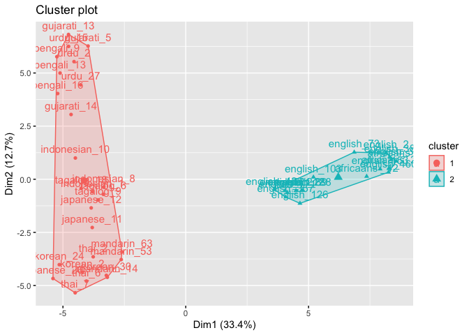

<!-- 
!!!! IMPORTANT: run `source("utils/render.R")` to publish instead of clicking on 'Knit'
-->

Data
----

We have data in wide format. Each row is a talker type and each col is a
participant.

``` r
df <- read_csv("data/class_wide_1.csv")
```

    ## Parsed with column specification:
    ## cols(
    ##   .default = col_double(),
    ##   speaker = col_character(),
    ##   `54` = col_character()
    ## )

    ## See spec(...) for full column specifications.

Clustering
==========

Introduction
------------

In this task, individuals heard spoken speech tokens and freely
classified them into groups. Using hierarchical clustering we aimed to
see what clusters or groups appear as a result of the free
classification task.

45 speech samples were selected from The Speech Accent Archive. The
talkers included three American English regional dialects, three
international English dialects, and nine nonnative accents. The
nonnative accents were split into three accents from East Asia, three
accents from South Asia, and three accents from Southeast Asia. The
American English dialects included the New England dialect, the Southern
dialect, and the Midland dialect. The international English dialects
included British English, Australian English, and Africaans. The native
languages of the nonnative-accented talkers were Mandarin, Korean, and
Japanese from East Asia, Bengali, Gujarati, and Urdu from South Asia,
and Indonesian, Tagalog, and Thai from Southeast Asia.

``` r
# For reproducibility
set.seed(666)
```

``` r
library(here)
library(tidyverse)  # data manipulation
library(cluster)    # clustering algorithms
library(factoextra) # clustering visualization
library(dendextend) # for comparing two dendrograms
```

### Data Preparation

1.  Rows are observations (individuals) and columns are variables
2.  Any missing value in the data must be removed or estimated.
3.  The data must be standardized (i.e., scaled) to make variables
    comparable if they are not on the same scale (I do not do it here).

### Read in the data

``` r
clust_data <- read_csv(here("data", "class_wide_1.csv")) # read in data
```

    ## Warning: Missing column names filled in: 'X1' [1]

    ## Parsed with column specification:
    ## cols(
    ##   .default = col_double(),
    ##   speaker = col_character(),
    ##   `54` = col_character()
    ## )

    ## See spec(...) for full column specifications.

``` r
clust_data <- select(clust_data, -X1, -`54`) # remove extra col sub 54 has weird formatting

clust_data <- as.data.frame(clust_data) # turn into df 

rownames(clust_data) <- clust_data$speaker # make row names speaker

clust_data <- select(clust_data,-speaker) # remove extra col sub 54 has weird formatting

head(clust_data)# show first couple rows
```

    ##             8 7 1 10 11 12 14 15 16 17 18 19 2 20 23 25 26 27 28 29  3 30 31 32 33 34 35 36 38 4 40 41 42 43 44 45 46 47 48 49
    ## bengali_9   1 5 5  1 11  2  1  8  4  2  2  1 9  7  4  5  1  1  1 11  5  1  7  7  9  8 10  8  1 3  1 10  1  1 12  1  5  1  5  8
    ## bengali_13  6 5 5  7 14  4  2  7  4  2  6  3 9  1  4  5  4  2  3 11 12  1  8 11  9  8 10 11  1 4 12  1  1  8 11  1  5  4  1  8
    ## bengali_16  1 5 5  7  7  4  3  6  2  8  3  3 3  1  3  4  6  1  3 10  2  1  7  8  9  8 10 11  6 3  8  8  1  8 11  1  1  2  5  7
    ## gujarati_5  4 5 5  1 14  4  1  7  4  9  9  1 9  4  3  5  4  2  4  8  9  1  7  9  9  6 10  8  1 2  8  7  1  8  8  3 11  2  2  8
    ## gujarati_13 1 5 5  1 15  4  2  8  4  2  6  1 9  4  5  5  6  2  4  8  5  1  7  9  9  8 10  2  1 2 12  1  1  8 11  1 11  6  5  8
    ## gujarati_14 5 5 5  1  7  4  1  8  4  9  9  3 9  5  7  5  4  4  6  1  5  1  6  9  9  6 10  9  1 4 13  2  1  8 11  6  3  4  5  8
    ##              5 50 51 52 53 55 56 58 59 6 78 87 90 91 96 105 110 111 115 121 123 125 132 133 135 148 151 152 153 155 156 157 158
    ## bengali_9    1  3  7  1  8  9  1  1  5 9  1 11  1 11  1   6  11   1   2   1   9   1   3   1   1   1   5   1   8   4   8   6   5
    ## bengali_13   5  4  7  3  8  9  1  8 11 7  1 11  1 11  1   6  11   7   8   6   9   1   6   2   3   6   9   1   8   4  10   6   5
    ## bengali_16   5  4  7  3  8  9  8  1  6 7  5 11  2  6  1   6  10   6   8   6  10  10   4   2   3   1   7   4   8  11   8   6   3
    ## gujarati_5  10  3  7 11  8  9  7  3 11 7  1 11  2 10  1   1  11   6   8   6   9  10   4   3   2   3   5   3   2   5   9   6   3
    ## gujarati_13  2  4  7  1  8  9  7 10  5 7  1 11  2 11  1   6  11   2   8   6   9  10   4   2   1   1   5   1   2   5   9   6   3
    ## gujarati_14  3  3  7 15  8  8  8  6  5 6  2 11  8 11  1   6  11   6   9   6   9   8   4   2   1   2   5   3   8   5   9   6   3
    ##             159 160 161 162 163 164 165 166 167 168 169
    ## bengali_9     1   5   1   7   4   1   5   1   7   1   2
    ## bengali_13    2   1  14   7   6   4   5   1   4   2   4
    ## bengali_16    2   3  14   7   7   1   5   1   7   4   4
    ## gujarati_5    1   3  14   7   5   6   6   1   4   2   5
    ## gujarati_13   1   4  14   7   5   6   5   1   7   3   6
    ## gujarati_14   8   4   5   3   7   6   7   6   7   5   1

Agglomerative Hierarchical Clustering
-------------------------------------

I am going to cluster the data using average link clustering. Average
link clustering computes all pairwise dissimilarities between the
elements, and considers the average of these dissimilarities as the
distance between clusters.

First, we calculate the dissimilarity matrix using euclidean distance.

Second, we comput the clustering with average link.

Third, we plot the cluster solution

``` r
# Dissimilarity matrix
d <- dist(clust_data, method = "euclidean")

# Hierarchical clustering using Average Linkage
hc1 <- hclust(d, method = "average" )

# Plot the obtained dendrogram
plot(hc1, cex = 0.6, hang = -1)
```


In the dendrogram displayed above, each leaf corresponds to one
observation. As we move up the tree, observations that are similar to
each other are combined into branches, which are themselves fused at a
higher height.

The height of the fusion, provided on the vertical axis, indicates the
(dis)similarity between two observations. The higher the height of the
fusion, the less similar the observations are. Note that, conclusions
about the proximity of two observations can be drawn only based on the
height where branches containing those two observations first are fused.
We cannot use the proximity of two observations along the horizontal
axis as a criteria of their similarity.

The height of the cut to the dendrogram controls the number of clusters
obtained. It plays the same role as the k in k-means clustering. In
order to identify sub-groups (i.e. clusters), we can cut the dendrogram
with cutree \#\#\# How many?

Although hierarchical clustering provides a fully connected dendrogram
representing the cluster relationships, you may still need to choose the
preferred number of clusters to extract. Fortunately we can execute
approaches similar to those discussed for k-means clustering (Section
20.6). The following compares results provided by the elbow, silhouette,
and gap statistic methods. There is no definitively clear optimal number
of clusters in this case; although, the silhouette method and Elbow
method suggest 2-5 clusters.

``` r
# Plot cluster results
p1 <- fviz_nbclust(clust_data, FUN = hcut, method = "wss", 
                   k.max = 10) +
  ggtitle("(A) Elbow method")
p2 <- fviz_nbclust(clust_data, FUN = hcut, method = "silhouette", 
                   k.max = 10) +
  ggtitle("(B) Silhouette method")
p3 <- fviz_nbclust(clust_data, FUN = hcut, method = "gap_stat", 
                   k.max = 10) +
  ggtitle("(C) Gap statistic")
```

    ## Clustering k = 1,2,..., K.max (= 10): .. done
    ## Bootstrapping, b = 1,2,..., B (= 100)  [one "." per sample]:
    ## .................................................. 50 
    ## .................................................. 100

``` r
# Display plots side by side
gridExtra::grid.arrange(p1, p2, p3, nrow = 1)
```


#### Dendrogram

Although it is a bit ambiguous I would say 3 clusters are the most
interpreatable. I could be wrong.

From this, we glean that 3 clusters appear to be adequate. Generally
participants grouped speakers into 3 clusters/groups:

-   English/African: Clust 1

-   Indo/European: Clust 2

-   Asian: Clust 3

``` r
hc.cut <- hcut(clust_data, k = 3, hc_method = "average")

fviz_dend(hc.cut, show_labels = TRUE, rect = TRUE)
```


Visualize Clusters
------------------

#### 3 Clusters

``` r
# Cut tree into 3 groups
sub_grp <- cutree(hc.cut, k = 3)

# Number of members in each cluster
table(sub_grp)
```

    ## sub_grp
    ##  1  2  3 
    ##  9 18 18

``` r
fviz_cluster(list(data = clust_data, cluster = sub_grp))
```


#### 4 clusters

``` r
# Cut tree into 3 groups
sub_grp <- cutree(hc.cut, k = 4)

# Number of members in each cluster
table(sub_grp)
```

    ## sub_grp
    ##  1  2  3  4 
    ##  9 16  2 18

``` r
fviz_cluster(list(data = clust_data, cluster = sub_grp))
```



#### 5 clusters

``` r
# Cut tree into 3 groups
sub_grp <- cutree(hc.cut, k = 5)

# Number of members in each cluster
table(sub_grp)
```

    ## sub_grp
    ##  1  2  3  4  5 
    ##  9  5  2 11 18

``` r
fviz_cluster(list(data = clust_data, cluster = sub_grp))
```


Conclusion
==========

I ran a hierarchical clustering analysis using the average link method
to classify talkers in a free classification task. I made the decision
that 3 clusters looks good. This is a subjective decision. You might
think that 4 or 5 clusters makes more sense. You should refer to the
elbow, shilotte, and gap plots above.

Full Code
=========

The full script of executive code contained in this document is
reproduced here.

``` r
df <- read_csv("data/class_wide_1.csv")
# For reproducibility
set.seed(666)
library(here)
library(tidyverse)  # data manipulation
library(cluster)    # clustering algorithms
library(factoextra) # clustering visualization
library(dendextend) # for comparing two dendrograms


clust_data <- read_csv(here("data", "class_wide_1.csv")) # read in data

clust_data <- select(clust_data, -X1, -`54`) # remove extra col sub 54 has weird formatting

clust_data <- as.data.frame(clust_data) # turn into df 

rownames(clust_data) <- clust_data$speaker # make row names speaker

clust_data <- select(clust_data,-speaker) # remove extra col sub 54 has weird formatting

head(clust_data)# show first couple rows

# Dissimilarity matrix
d <- dist(clust_data, method = "euclidean")

# Hierarchical clustering using Average Linkage
hc1 <- hclust(d, method = "average" )

# Plot the obtained dendrogram
plot(hc1, cex = 0.6, hang = -1)

# Plot cluster results
p1 <- fviz_nbclust(clust_data, FUN = hcut, method = "wss", 
                   k.max = 10) +
  ggtitle("(A) Elbow method")
p2 <- fviz_nbclust(clust_data, FUN = hcut, method = "silhouette", 
                   k.max = 10) +
  ggtitle("(B) Silhouette method")
p3 <- fviz_nbclust(clust_data, FUN = hcut, method = "gap_stat", 
                   k.max = 10) +
  ggtitle("(C) Gap statistic")

# Display plots side by side
gridExtra::grid.arrange(p1, p2, p3, nrow = 1)


hc.cut <- hcut(clust_data, k = 3, hc_method = "average")

fviz_dend(hc.cut, show_labels = TRUE, rect = TRUE)

# Cut tree into 3 groups
sub_grp <- cutree(hc.cut, k = 3)

# Number of members in each cluster
table(sub_grp)

fviz_cluster(list(data = clust_data, cluster = sub_grp))
# Cut tree into 3 groups
sub_grp <- cutree(hc.cut, k = 4)

# Number of members in each cluster
table(sub_grp)

fviz_cluster(list(data = clust_data, cluster = sub_grp))
# Cut tree into 3 groups
sub_grp <- cutree(hc.cut, k = 5)

# Number of members in each cluster
table(sub_grp)

fviz_cluster(list(data = clust_data, cluster = sub_grp))
```

References
==========
