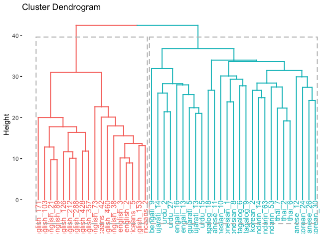
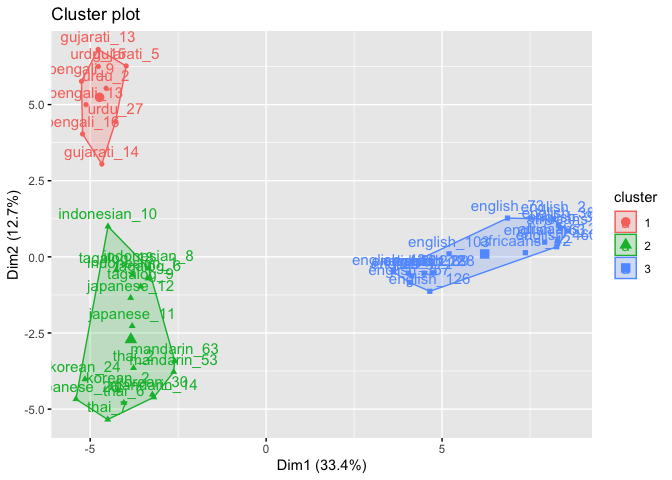

<!-- 
!!!! IMPORTANT: run `source("utils/render.R")` to publish instead of clicking on 'Knit'
-->

Data
----

Eighty-four participants (one participant was not used due to some weird
coding issue) took part in a free speech classification task. The speech
samples were selected from The Speech Accent Archive. The talkers
included three American English regional dialects, three international
English dialects, and nine nonnative accents. The nonnative accents were
split into three accents from East Asia, three accents from South Asia,
and three accents from Southeast Asia. The American English dialects
included the New England dialect, the Southern dialect, and the Midland
dialect. The international English dialects included British English,
Australian English, and Africaans. The native languages of the
nonnative-accented talkers were Mandarin, Korean, and Japanese from East
Asia, Bengali, Gujarati, and Urdu from South Asia, and Indonesian,
Tagalog, and Thai from Southeast Asia. We have data in wide format. Each
row is a talker type and each col is a participant.

Clustering
==========

Introduction
------------

In this task, individuals heard speech tokens from a number of different
speakers and freely classified them into groups. Based on previous work,
I used hierarchical clustering to examine what natural clusters or
groups formed as the result of this free classification.

``` r
# For reproducibility
set.seed(666)
```

``` r
library(here)
library(tidyverse)  # data manipulation
library(cluster)    # clustering algorithms
library(factoextra) # clustering visualization
library(dendextend) # for comparing two dendrograms
library(fpc) # kmeans clustering
```

Data Preparation
----------------

1.  I wrangled the DF so that each row corresponds to each talker and
    each column corresponds to each participant.
2.  I removed missing data.
3.  I did not standardize the data.

### Read in the data

``` r
clust_data <- read_csv(here("data", "class_wide_1.csv")) # read in data
```

    ## Warning: Missing column names filled in: 'X1' [1]

    ## Parsed with column specification:
    ## cols(
    ##   .default = col_double(),
    ##   speaker = col_character(),
    ##   `54` = col_character()
    ## )

    ## See spec(...) for full column specifications.

``` r
clust_data <- select(clust_data, -X1, -`54`) # remove extra col sub 54 has weird formatting

clust_data <- as.data.frame(clust_data) # turn into df 

rownames(clust_data) <- clust_data$speaker # make row names speaker

clust_data <- select(clust_data,-speaker) # remove extra col sub 54 has weird formatting

head(clust_data)# show first couple rows
```

    ##             8 7 1 10 11 12 14 15 16 17 18 19 2 20 23 25 26 27 28 29  3 30 31 32 33 34 35 36 38 4 40 41 42 43 44
    ## bengali_9   1 5 5  1 11  2  1  8  4  2  2  1 9  7  4  5  1  1  1 11  5  1  7  7  9  8 10  8  1 3  1 10  1  1 12
    ## bengali_13  6 5 5  7 14  4  2  7  4  2  6  3 9  1  4  5  4  2  3 11 12  1  8 11  9  8 10 11  1 4 12  1  1  8 11
    ## bengali_16  1 5 5  7  7  4  3  6  2  8  3  3 3  1  3  4  6  1  3 10  2  1  7  8  9  8 10 11  6 3  8  8  1  8 11
    ## gujarati_5  4 5 5  1 14  4  1  7  4  9  9  1 9  4  3  5  4  2  4  8  9  1  7  9  9  6 10  8  1 2  8  7  1  8  8
    ## gujarati_13 1 5 5  1 15  4  2  8  4  2  6  1 9  4  5  5  6  2  4  8  5  1  7  9  9  8 10  2  1 2 12  1  1  8 11
    ## gujarati_14 5 5 5  1  7  4  1  8  4  9  9  3 9  5  7  5  4  4  6  1  5  1  6  9  9  6 10  9  1 4 13  2  1  8 11
    ##             45 46 47 48 49  5 50 51 52 53 55 56 58 59 6 78 87 90 91 96 105 110 111 115 121 123 125 132 133 135
    ## bengali_9    1  5  1  5  8  1  3  7  1  8  9  1  1  5 9  1 11  1 11  1   6  11   1   2   1   9   1   3   1   1
    ## bengali_13   1  5  4  1  8  5  4  7  3  8  9  1  8 11 7  1 11  1 11  1   6  11   7   8   6   9   1   6   2   3
    ## bengali_16   1  1  2  5  7  5  4  7  3  8  9  8  1  6 7  5 11  2  6  1   6  10   6   8   6  10  10   4   2   3
    ## gujarati_5   3 11  2  2  8 10  3  7 11  8  9  7  3 11 7  1 11  2 10  1   1  11   6   8   6   9  10   4   3   2
    ## gujarati_13  1 11  6  5  8  2  4  7  1  8  9  7 10  5 7  1 11  2 11  1   6  11   2   8   6   9  10   4   2   1
    ## gujarati_14  6  3  4  5  8  3  3  7 15  8  8  8  6  5 6  2 11  8 11  1   6  11   6   9   6   9   8   4   2   1
    ##             148 151 152 153 155 156 157 158 159 160 161 162 163 164 165 166 167 168 169
    ## bengali_9     1   5   1   8   4   8   6   5   1   5   1   7   4   1   5   1   7   1   2
    ## bengali_13    6   9   1   8   4  10   6   5   2   1  14   7   6   4   5   1   4   2   4
    ## bengali_16    1   7   4   8  11   8   6   3   2   3  14   7   7   1   5   1   7   4   4
    ## gujarati_5    3   5   3   2   5   9   6   3   1   3  14   7   5   6   6   1   4   2   5
    ## gujarati_13   1   5   1   2   5   9   6   3   1   4  14   7   5   6   5   1   7   3   6
    ## gujarati_14   2   5   3   8   5   9   6   3   8   4   5   3   7   6   7   6   7   5   1

Agglomerative Hierarchical Clustering
-------------------------------------

I am going to cluster the data using average link clustering. Average
link clustering computes all pairwise dissimilarities between the
elements, and considers the average of these dissimilarities as the
distance between clusters.

1.  I calculate the dissimilarity matrix using euclidean distance.

2.  I compute the clustering with average link.

3.  I plot the cluster solution

``` r
# Dissimilarity matrix
d <- dist(clust_data, method = "euclidean")

# Hierarchical clustering using Average Linkage
hc1 <- hclust(d, method = "average" )

# Plot the obtained dendrogram
plot(hc1, cex = 0.6, hang = -1)
```


### How Many Clusters?

In the dendrogram displayed above, each leaf corresponds to one
observation. As we move up the tree, observations that are similar to
each other are combined into branches, which are themselves fused at a
higher height.

The height of the fusion, provided on the vertical axis, indicates the
(dis)similarity between two observations. The higher the height of the
fusion, the less similar the observations are. Note that, conclusions
about the proximity of two observations can be drawn only based on the
height where branches containing those two observations first are fused.
We cannot use the proximity of two observations along the horizontal
axis as a criteria of their similarity.

Although hierarchical clustering provides a fully connected dendrogram
representing the cluster relationships, you may still need to choose the
preferred number of clusters to extract. Fortunately we can execute
approaches similar to k-means clustering. The following compares results
provided by the elbow, silhouette, and gap statistic methods. There is
no definitively clear optimal number of clusters in this case; although,
the silhouette method and Elbow method suggests anywhere between 2-5
clusters.

Humans cant live with this ambiguity. Let’s use k-means clustering to
determine the number of clusters we should use.

``` r
# Plot cluster results
p1 <- fviz_nbclust(clust_data, FUN = hcut, method = "wss", 
                   k.max = 10) +
  ggtitle("(A) Elbow method")
p2 <- fviz_nbclust(clust_data, FUN = hcut, method = "silhouette", 
                   k.max = 10) +
  ggtitle("(B) Silhouette method")
p3 <- fviz_nbclust(clust_data, FUN = hcut, method = "gap_stat", 
                   k.max = 10) +
  ggtitle("(C) Gap statistic")
```

    ## Clustering k = 1,2,..., K.max (= 10): .. done
    ## Bootstrapping, b = 1,2,..., B (= 100)  [one "." per sample]:
    ## .................................................. 50 
    ## .................................................. 100

``` r
# Display plots side by side
gridExtra::grid.arrange(p1, p2, p3, nrow = 1)
```


``` r
ggsave("HCstats.png", width=10, height=8)
```

K-means
-------

K-means is another type of clustering algorithm. For a more objective
way to determine how many clusters there are, I am going to run k-means
clustering over a range of cluster values (here 3-10 clusters). I will
use the `fpc` package and the `kmeansrun` function. This function
iterates over a number of clusters and chooses the best number of
clusters.

``` r
#run kmeans over a number of ranges (3:10) here

cl <- kmeansruns(clust_data, krange = 2:10, iter.max = 1000)

# pick the best one
cl$bestk
```

    ## [1] 2

The k-means analysis suggests 2 clusters is best. I personally think 3
clusters better represents the data. It is really a subjective call on
your part. Let’s visualize both to see what the clusters look like.

Visualize Clusters
------------------

### Dendogram

#### 2 clusters

Here is a dendogram cut at 2.

``` r
hc.cut <- hcut(clust_data, k = 2, hc_method = "average")

fviz_dend(hc.cut, show_labels = TRUE, rect = TRUE)
```



``` r
ggsave("dendogram2.png", width=10, height=8, dpi=700)
```

Here is a dendogram cut at 3.

``` r
hc.cut <- hcut(clust_data, k = 3, hc_method = "average")

fviz_dend(hc.cut, show_labels = TRUE, rect = TRUE)
```


``` r
ggsave("dendogram3.png", width=10, height=8, dpi=700)
```

#### 2 Clusters

Let’s visualize the clusters in two dimensions as it is a bit easier to
read that the above dendrogram. I saved this cluster figure as
“2clust.png.”

``` r
# Cut tree into 3 groups
sub_grp <- cutree(hc.cut, k = 2)

# Number of members in each cluster
sub_grp
```

    ##     bengali_9    bengali_13    bengali_16    gujarati_5   gujarati_13   gujarati_14        urdu_2       urdu_15 
    ##             1             1             1             1             1             1             1             1 
    ##       urdu_27  indonesian_1  indonesian_8 indonesian_10     tagalog_6     tagalog_9    tagalog_18        thai_2 
    ##             1             1             1             1             1             1             1             1 
    ##        thai_6        thai_7   japanese_11   japanese_12   japanese_26      korean_2     korean_24     korean_30 
    ##             1             1             1             1             1             1             1             1 
    ##   mandarin_14   mandarin_53   mandarin_63    english_21    english_89   english_103   english_428   english_212 
    ##             1             1             1             2             2             2             2             2 
    ##   english_357   english_288   english_171   english_126     english_3    english_73   english_153     english_2 
    ##             2             2             2             2             2             2             2             2 
    ##    english_38   english_460   africaans_2  africaans _5 africaans _42 
    ##             2             2             2             2             2

``` r
fviz_cluster(list(data = clust_data, cluster = sub_grp))
```


``` r
ggsave("2clust.png", width=10, height=8, dpi=700)
```

#### 3 Clusters

Let’s visualize the clusters in two dimensions as it is a bit easier to
read that the above dendrogram. I saved this cluster figure as
“3clust.png.” I also saved the data with the cluster number of each
speech token as “speech_group.csv.” With this you can visualize the
clusters how you want.

``` r
# Cut tree into 3 groups
sub_grp <- cutree(hc.cut, k = 3)

# Number of members in each cluster
sub_grp
```

    ##     bengali_9    bengali_13    bengali_16    gujarati_5   gujarati_13   gujarati_14        urdu_2       urdu_15 
    ##             1             1             1             1             1             1             1             1 
    ##       urdu_27  indonesian_1  indonesian_8 indonesian_10     tagalog_6     tagalog_9    tagalog_18        thai_2 
    ##             1             2             2             2             2             2             2             2 
    ##        thai_6        thai_7   japanese_11   japanese_12   japanese_26      korean_2     korean_24     korean_30 
    ##             2             2             2             2             2             2             2             2 
    ##   mandarin_14   mandarin_53   mandarin_63    english_21    english_89   english_103   english_428   english_212 
    ##             2             2             2             3             3             3             3             3 
    ##   english_357   english_288   english_171   english_126     english_3    english_73   english_153     english_2 
    ##             3             3             3             3             3             3             3             3 
    ##    english_38   english_460   africaans_2  africaans _5 africaans _42 
    ##             3             3             3             3             3

``` r
fviz_cluster(list(data = clust_data, cluster = sub_grp))
```



``` r
ggsave("3clust.png", width=10, height=8, dpi=700)
```

Conclusion
==========

From this, we glean that two clusters are adequate.

I think 3 better represents the data, however.

-   Cluster 1: English/African

-   Cluster 2: Indo/European

-   Cluster 3: Asian

Just to summarize, I ran a hierarchical clustering analysis using the
average link method to classify talkers in a free classification task.
Because there was some ambiguity in terms of the correct correct number
of clusters, I ran an iterative k-means analysis ranging from two
clusters to ten cluster. This analysis suggested we should use two
clusters. If you think three clusters better represents the data please
use three instead.

Full Code
=========

The full script of executive code contained in this document is
reproduced here.

``` r
# For reproducibility
set.seed(666)
library(here)
library(tidyverse)  # data manipulation
library(cluster)    # clustering algorithms
library(factoextra) # clustering visualization
library(dendextend) # for comparing two dendrograms
library(fpc) # kmeans clustering


clust_data <- read_csv(here("data", "class_wide_1.csv")) # read in data

clust_data <- select(clust_data, -X1, -`54`) # remove extra col sub 54 has weird formatting

clust_data <- as.data.frame(clust_data) # turn into df 

rownames(clust_data) <- clust_data$speaker # make row names speaker

clust_data <- select(clust_data,-speaker) # remove extra col sub 54 has weird formatting

head(clust_data)# show first couple rows

# Dissimilarity matrix
d <- dist(clust_data, method = "euclidean")

# Hierarchical clustering using Average Linkage
hc1 <- hclust(d, method = "average" )

# Plot the obtained dendrogram
plot(hc1, cex = 0.6, hang = -1)

# Plot cluster results
p1 <- fviz_nbclust(clust_data, FUN = hcut, method = "wss", 
                   k.max = 10) +
  ggtitle("(A) Elbow method")
p2 <- fviz_nbclust(clust_data, FUN = hcut, method = "silhouette", 
                   k.max = 10) +
  ggtitle("(B) Silhouette method")
p3 <- fviz_nbclust(clust_data, FUN = hcut, method = "gap_stat", 
                   k.max = 10) +
  ggtitle("(C) Gap statistic")

# Display plots side by side
gridExtra::grid.arrange(p1, p2, p3, nrow = 1)

ggsave("HCstats.png", width=10, height=8)

#run kmeans over a number of ranges (3:10) here

cl <- kmeansruns(clust_data, krange = 2:10, iter.max = 1000)

# pick the best one
cl$bestk


hc.cut <- hcut(clust_data, k = 2, hc_method = "average")

fviz_dend(hc.cut, show_labels = TRUE, rect = TRUE)


ggsave("dendogram2.png", width=10, height=8, dpi=700)


hc.cut <- hcut(clust_data, k = 3, hc_method = "average")

fviz_dend(hc.cut, show_labels = TRUE, rect = TRUE)


ggsave("dendogram3.png", width=10, height=8, dpi=700)

# Cut tree into 3 groups
sub_grp <- cutree(hc.cut, k = 2)

# Number of members in each cluster
sub_grp

fviz_cluster(list(data = clust_data, cluster = sub_grp))

ggsave("2clust.png", width=10, height=8, dpi=700)
# Cut tree into 3 groups
sub_grp <- cutree(hc.cut, k = 3)

# Number of members in each cluster
sub_grp

fviz_cluster(list(data = clust_data, cluster = sub_grp))

ggsave("3clust.png", width=10, height=8, dpi=700)
```

References
==========
